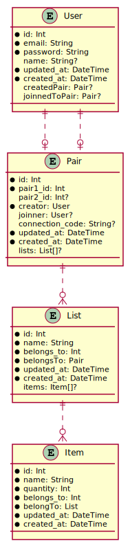

# Shopairs szerver dokumentáció


## Fejlesztői környezet bemutatása, beállítása, használt technológiák


A szerver nodeJs-ben fut, amit TypeScript-ben írunk. Az adatbázis kezeléséért a [Prisma](https://www.prisma.io/) felel.


Az adatbázis [séma](./prisma/schema.prisma) a prisma saját formátúma alapján van leírva. Ennek válatozásaibó a prisma segítségével könnyen előállíthatóak a migrációs fájlok, melyen a `prisma/migrations/` mappában vannak, külön leírással, hogy éppen mi változik.


Az adatbázis egyenlőre sqlite.


A szerver websocket-en keresztül érhető el. Ehhez a socket.io könyvtárat használjuk.


### Setup


#### Adatbázis - Prisma
```bash
npx prisma migrate up --experimental
```
<!-- TODO make seeder -->

#### Szerver build & run
```bash
npm run build
npm start
```

<!-- TODO add testing -->

## Adatbázis-terv: táblák kapcsolati UML diagramja
```bash
npx prisma-uml prisma/schema.prisma -o svg -f prisma/uml.svg
```


Adatbázis megtekintése
```bash
npx prisma studio
```

## Alkalmazott könyvtárstruktúra bemutatása
<!-- TODO update with tests folder -->
```bash
tree -I node_modules -L 3
.
├── db
│   └── dev.db
├── dist
│   ├── server.js
│   └── utils
│       ├── codeGenerator.js
│       ├── DatabaseHandler.js
│       ├── passwordHash.js
│       └── SocketEventHandler.js
├── package.json
├── package-lock.json
├── prisma
│   ├── migrations
│   │   ├── 20201026125142-init
│   │   ├── 20201026132644-date
│   │   ├── 20201026140825-pair-nullable
│   │   ├── 20201026150646-created-proper-relations
│   │   ├── 20201026151206-made-the-connection-code-nullable
│   │   ├── 20201027163352-made-pair-code-unique
│   │   ├── 20201101112133-created-list-and-item-model
│   │   └── migrate.lock
│   ├── schema.prisma
│   └── uml.svg
├── README.MD
└── src
    ├── server.ts
    ├── tsconfig.json
    └── utils
        ├── codeGenerator.ts
        ├── DatabaseHandler.ts
        ├── passwordHash.ts
        └── SocketEventHandler.ts

14 directories, 18 files
```

`db/` tartalmazza az sqlite adatbázist

`src/` a source code helye

`src/utils/` a szervezhez felhasznált modulok

`dist/` a build-elt kód

`prisma/` a prisma fájlkjai (séma, migrációs fájlok, uml diagramm)

## Végpont-tervek és leírások
<!-- TODO -->

## 1 db végpont működésének leírása, mi történik, milyen lépések követik egymást (szekvenciadiagram)
<!-- TODO -->

## fontosabb specifikumok bemutatása (ha van ilyen)
<!-- TODO -->
